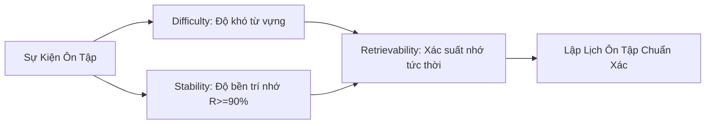

# Hành Trình Chế Tác Ultimate Celestial Vocab: Từ Thẻ Giấy Gấp Vội Đến Cỗ Máy Ghi Nhớ FSRS-7 Chuẩn Khoa Học

---

## 📌 Bảng Thông Tin Thiết Lập (Dùng điền nhanh vào Form `/journey`)

| Trường Dữ Liệu | Giá Trị Gợi Ý |
| :--- | :--- |
| **Loại bài viết (Type)** | `project` *(Dự Án Đã Ship)* hoặc `milestone` *(Cột Mốc Vàng)* |
| **Trạng thái (Status)** | `published` *(Công khai)* |
| **Tâm trạng (Mood)** | `🚀` Bứt phá hoặc `⚡` Code xuyên đêm |
| **Huy hiệu (Badge)** | `FLAGSHIP PROJECT` |
| **Tiêu đề (Title)** | `Hành Trình Chế Tác Ultimate Celestial Vocab: Từ Thẻ Giấy Gấp Vội Đến Cỗ Máy Ghi Nhớ FSRS-7 Chuẩn Khoa Học` |
| **Phụ đề (Subtitle)** | `Đóng gói thuật toán khoa học nhận thức FSRS-7, động cơ đồng bộ 4-Vector thời gian thực và ngôn ngữ thiết kế Celestial Universe vào một Web App học ngoại ngữ đỉnh cao.` |
| **Thẻ chủ đề (Tags)** | `WebDev, FSRS7, SpacedRepetition, Firebase, UIUX, Celestial, OpenSource` |
| **Liên kết (Link)** | `https://chat-wywy.web.app` |
| **Ảnh bìa (Cover)** | `https://raw.githubusercontent.com/DATWY/ultimate-celestial-vocab/main/docs/screenshots/app_dashboard.webp` |

---

## 📝 Nội Dung Bài Viết (Copy dán trực tiếp vào khung Markdown)

### 🌟 Khởi Đầu: Từ Chiếc Thẻ Giấy Gấp Vội Đến Nỗi Trăn Trở Của Người Học

Mọi lập trình viên khi tự học ngoại ngữ có lẽ đều từng rơi vào cái vòng lặp quen thuộc: chép từ vựng vào sổ tay, dùng flashcard giấy, rồi chuyển sang các ứng dụng nổi tiếng như Anki hay Quizlet. Nhưng sau vài tuần, sự hào hứng ban đầu thường bị dập tắt bởi hai thứ: **giao diện khô khan, tù túng** và **cảm giác bị "ngợp" vì thuật toán lặp lại thiếu linh hoạt**.

> *"Khi học tập trở thành một nghĩa vụ gượng ép, trí não sẽ tự động đóng cửa. Nhưng khi việc ghi nhớ được hỗ trợ bởi toán học chính xác và một không gian thị giác truyền cảm hứng, việc học sẽ trở thành niềm say mê tự nhiên."*

Ý tưởng về **Ultimate Celestial Vocab** ra đời từ chính mong muốn đó: Tạo ra một không gian học tập mang tầm vóc một **Cognitive Memory Engine** (Cỗ máy nhận thức cá nhân), nơi giao thoa hoàn mỹ giữa **khoa học thần kinh nhận thức hiện đại** và **ngôn ngữ thiết kế vũ trụ (Celestial Aesthetic)** đỉnh cao.

---

### 🧠 Trái Tim Của Dự Án: Cuộc Cách Mạng FSRS-7 (Free Spaced Repetition Scheduler)

Hầu hết các ứng dụng ghi nhớ hiện nay vẫn đang sử dụng thuật toán cổ điển **SM-2** (ra đời từ năm 1987) với công thức nhân hệ số cố định. SM-2 xem mọi bộ não như nhau và không tính toán được mức độ suy giảm trí nhớ thực tế khi bạn ôn tập trễ hạn hay ôn trước thời hạn.

Ở **Ultimate Celestial Vocab**, mình đã quyết định tích hợp trọn vẹn mô hình toán học **FSRS-7** với cấu trúc **DSR (Difficulty - Stability - Retrievability)**:

#### Điểm đột phá kỹ thuật:
1. **Mô hình DSR 3 chiều**: 
   - **Difficulty ($D$)**: Đo lường độ phức tạp nội tại của từ vựng (thang điểm 1–10).
   - **Stability ($S$)**: Thời gian (tính bằng ngày) mà trí nhớ giữ được xác suất hồi tưởng $\ge 90\%$.
   - **Retrievability ($R$)**: Ước lượng xác suất bạn còn nhớ từ vựng tại thời điểm hiện tại: $R(t) = (1 + 19 \cdot t / S)^{-0.5}$.
2. **Dual-Track Stability & Heuristics v2**: Xử lý thông minh khi ôn tập lệch thời gian:
   - *Ôn trễ (Overdue Review)*: Thưởng độ bền cấp số cộng nếu bạn vẫn nhớ được từ vựng sau một thời gian dài bỏ quên.
   - *Ôn sớm (Early Review)*: Điều chỉnh bước nhảy vừa phải để tránh lãng phí thời gian ôn tập thừa.
3. **In-Browser Calibration Engine**: Ứng dụng tích hợp bộ giải thuật tối ưu hóa phi tuyến tính cục bộ ngay trên trình duyệt (Offline Optimization), tự động tinh chỉnh 21 siêu tham số của FSRS dựa trên lịch sử bấm nút (`Again`, `Hard`, `Good`, `Easy`) của chính người dùng.

---

### 🎨 Ngôn Ngữ Thiết Kế: Vũ Trụ "Celestial Universe"

Một giao diện đẹp không chỉ để ngắm, mà nó trực tiếp kích thích cảm giác tập trung và dopamine khi học:

* **Bento Grid & Glassmorphism Đa Tầng**: Các bảng thống kê, thẻ từ vựng và bảng điều khiển được tổ chức dạng Bento hộp mở, sử dụng hiệu ứng kính mờ (backdrop-filter) với ánh sáng Aurora đa sắc.
* **Hạt Stardust Canvas Tương Tác**: Bụi sao không gian chuyển động êm ái dưới nền canvas, phản hồi mượt mà theo từng cử chỉ chuột.
* **Âm Thanh Tương Tác Tần Số Cao (Web Audio API)**: Từng cú lật thẻ, chấm điểm hay vượt qua mốc từ đều phát ra âm hưởng du dương được tổng hợp trực tiếp bằng dao động sóng (OscillatorNode), loại bỏ hoàn toàn việc tải các tệp MP3 nặng nề.
* **Song Hành Sáng & Tối (Breeze Light & Cosmic Dark)**: Bản cập nhật mới nhất tái định nghĩa hoàn toàn giao diện sáng với tông Mint-Cyan pastel tươi tắn, thanh thoát, giảm áp lực thị giác khi học vào ban ngày.

---

### ⚡ 4-Vector Sync Engine: Đồng Bộ Đa Thiết Bị Không Xung Đột

Là một người thường xuyên di chuyển giữa máy tính bàn và điện thoại, bài toán đồng bộ dữ liệu học tập là một thách thức lớn. Mình đã tự tay xây dựng cơ chế **Real-time 4-Vector Merger** kết hợp cùng Firebase Realtime Database:

> [!NOTE]
> Mỗi lần tương tác học tập sinh ra một vector gồm: `[Timestamp, VectorClock, RepetitionCount, LastReviewTime]`. Khi hai thiết bị ghi đè cùng lúc, thuật toán hòa giải sẽ tự động hợp nhất tiến độ cao nhất mà không làm mất lịch sử ôn tập hay sai lệch chu kỳ FSRS.

---

### ☕ Chiêm Nghiệm Cá Nhân: Giá Trị Của Việc "Làm Đến Cùng"

Có những đêm sau giờ làm, trở về phòng trọ khi đường phố đã vắng tanh, mình lại ngồi trước màn hình bật trình giả lập kiểm tra từng góc bo viền, từng phần trăm xác suất của đường cong lãng quên Ebbinghaus. 

Có người hỏi: *"Chỉ là một web học từ vựng thôi, có cần phải đưa cả thuật toán ma trận và tối ưu WebP, nén từng kilobyte như vậy không?"*

Câu trả lời của mình là: **Có**. 
Bởi vì sự khác biệt giữa một dự án làm chơi và một sản phẩm thực thụ nằm ở **sự tôn trọng dành cho từng trải nghiệm nhỏ nhất của người dùng**. Dự án này không chỉ là một công cụ giúp mình học ngoại ngữ tốt hơn, mà nó là minh chứng cho sự trưởng thành về tư duy kiến trúc phần mềm, năng lực giải quyết bài toán phức tạp và tinh thần kiên trì theo đuổi sự hoàn hảo.

---

### 🚀 Trải Nghiệm Sản Phẩm & Mã Nguồn

Dự án hiện đã hoàn thiện giai đoạn triển khai chính thức và mở mã nguồn hoàn toàn cho cộng đồng:

* 🌐 **Trải nghiệm trực tiếp:** [chat-wywy.web.app](https://chat-wywy.web.app)
* 💻 **Kho mã nguồn GitHub:** [github.com/DATWY/ultimate-celestial-vocab](https://github.com/DATWY/ultimate-celestial-vocab)
* 📊 **Công nghệ cốt lõi:** *Vanilla JS (ES6+ Modules), Vite, FSRS-7 Engine, Firebase RTDB/Hosting, Web Audio API, Canvas Animation.*
