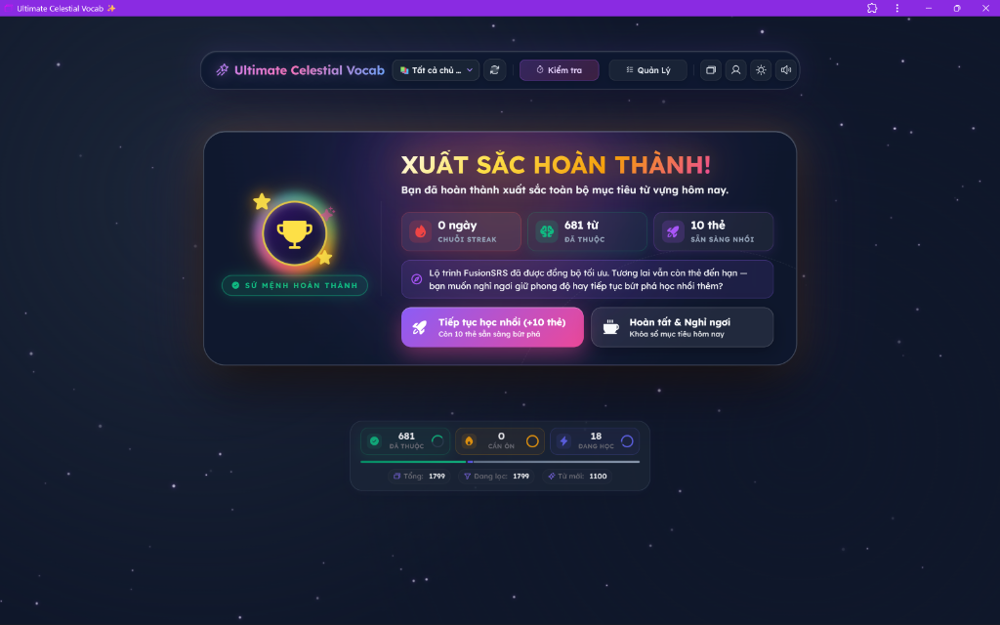
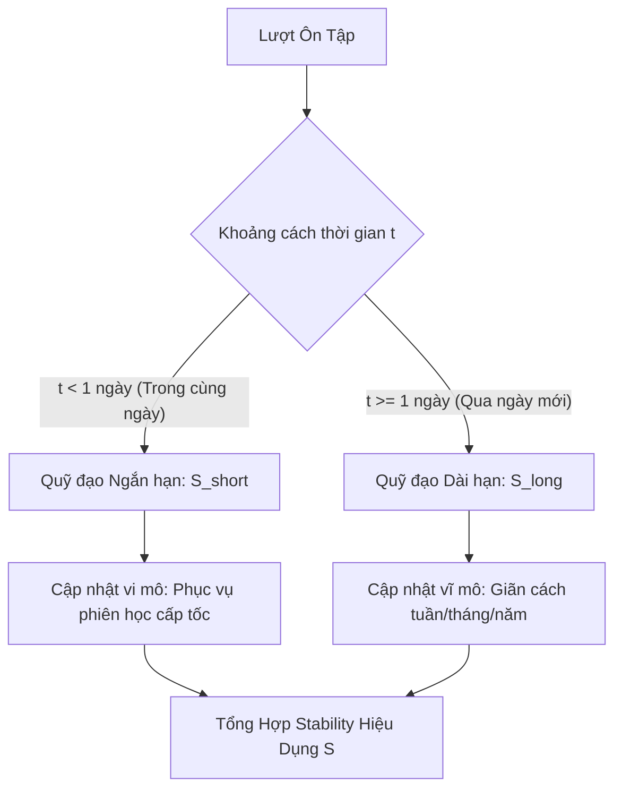
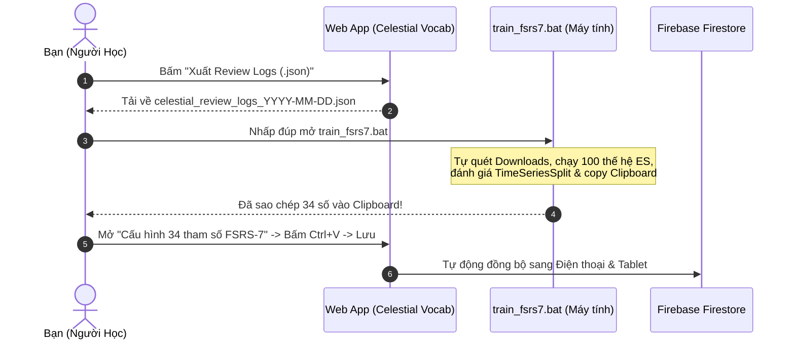
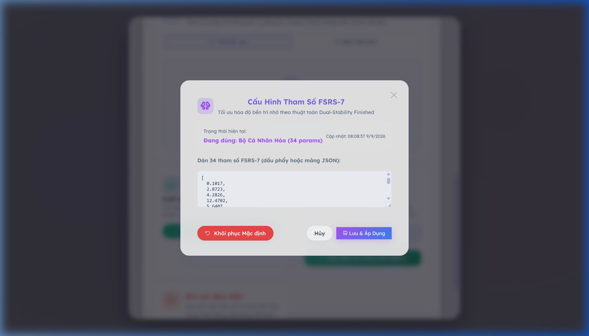

# Ultimate Celestial Vocab ✨

<div align="center">


-blueviolet.svg?style=for-the-badge)
-success.svg?style=for-the-badge)


<br/>

**Nền tảng học từ vựng tiếng Anh cá nhân hóa thế hệ mới với thuật toán FSRS-7 (34 tham số), Heuristics ngôn ngữ học và Hệ sinh thái Offline-First PWA.**

[⚡ Hướng Dẫn Khởi Chạy Cục Bộ (Localhost)](#cai-dat) • [📖 Xem Tài Liệu Thiết Kế Kỹ Thuật](DESIGN_DOC.md) • [📊 Xem Dữ Liệu Benchmark](#benchmark)

<br/>



</div>

---

## 📑 Mục Lục
- [1. Giới Thiệu & Tầm Nhìn](#gioi-thieu)
- [2. Cơ Sở Khoa Học & Thuật Toán FSRS-7](#co-so-khoa-hoc)
  - [2.1. Mô hình DSR (Difficulty - Stability - Retrievability)](#dsr-model)
  - [2.2. Kiến Trúc Trí Nhớ Kép (Dual-Track Stability)](#dual-track)
  - [2.3. Động Học Độ Khó & Hội Tụ Trung Bình (Mean Reversion)](#mean-reversion)
  - [2.4. Ba Đột Phá Độc Quyền Của Celestial Vocab](#dot-pha)
- [3. Bộ Tối Ưu Hóa Tham Số Ngoại Tuyến (Offline Optimizer)](#bo-toi-uu-hoa)
  - [3.1. Thuật Toán Chiến Lược Tiến Hóa (1+λ)-ES](#thuat-toan-es)
  - [3.2. Kiểm Định Ngoại Suất Tương Lai (TimeSeriesSplit)](#timeseriessplit)
- [4. Bằng Chứng & Dữ Liệu Thực Nghiệm (Benchmark)](#benchmark)
  - [4.1. Tập Dữ Liệu Thực Tế (4.046 Lượt Ôn Tập)](#tap-du-lieu)
  - [4.2. Bảng Hiệu Chuẩn Xác Suất Trí Nhớ (Calibration Table)](#calibration-table)
- [5. Hướng Dẫn Sử Dụng & Huấn Luyện 1-Click](#huong-dan-su-dung)
- [6. Kiến Trúc Hệ Thống & Luồng Dữ Liệu](#kien-truc-he-thong)
- [7. Bảo Mật & Quản Lý Biến Môi Trường](#bao-mat)
- [8. Hướng Dẫn Cài Đặt Cho Lập Trình Viên](#cai-dat)
- [9. Giấy Phép & Tác Giả](#giay-phep)

---

<a id="gioi-thieu"></a>
## 1. Giới Thiệu & Tầm Nhìn

Hầu hết các phần mềm học từ vựng truyền thống hiện nay (Anki cổ điển, Quizlet, SuperMemo SM-2) đều gặp phải các giới hạn sinh học cố hữu:
1. **"Ease Hell" (Địa ngục độ dễ):** Khi người học lỡ bấm nút *Hard* hoặc *Again*, hệ số Ease Factor bị trừ vĩnh viễn, khiến thẻ bài bị lặp lại dày đặc quá mức gây chán nản.
2. **Đồng nhất hóa não bộ:** Giả định rằng mọi bộ não đều quên theo cùng một tốc độ và mọi từ vựng đều có độ khó khởi điểm như nhau.
3. **Thiếu sự phân hóa phản xạ:** Không phân biệt được giữa việc nhìn nhận mặt chữ thụ động (Flashcard flip) với việc kích hoạt hồi tưởng chủ động bằng cách gõ phím chính xác (Active Typing Recall).

**Ultimate Celestial Vocab** ra đời nhằm giải quyết triệt để các vấn đề trên bằng cách kết hợp:
- **Lõi FSRS-7 (Free Spaced Repetition Scheduler - Thế hệ 7):** Mô hình trí nhớ toán học chính xác nhất hiện nay với 34 tham số thích ứng sinh học.
- **Linguistic Heuristics v2:** Bộ máy phân tích âm tiết, cấu trúc cụm từ và hình thái ngôn ngữ để tính toán độ khó xuất phát điểm $D_0$ khách quan ngay cả khi người học chưa chạm vào thẻ.
- **Hệ thống Huấn luyện Cục bộ 1-Click (`train_fsrs7.bat`):** Cho phép người học tự trích xuất dữ liệu, tối ưu hóa bộ 34 số độc bản cho riêng não bộ của mình mà không phụ thuộc vào máy chủ đám mây.

<br/>

### 📸 Trải Nghiệm Học Tập Trực Quan (Active Recall & Audio Waveform)

<div align="center">

| Mặt Trước (Câu hỏi, Phiên âm IPA & Sóng âm) | Mặt Sau (Định nghĩa, Ngữ cảnh & 4 Nút đánh giá SRS) |
| :---: | :---: |
|  |  |

*Giao diện học từ vựng trực quan với nền sao chuyển động mượt mà, tích hợp đọc phát âm Web Audio API và chế độ gõ phím chính tả.*

</div>

---

<a id="co-so-khoa-hoc"></a>
## 2. Cơ Sở Khoa Học & Thuật Toán FSRS-7

<a id="dsr-model"></a>
### 2.1. Mô hình DSR (Difficulty - Stability - Retrievability)
Trí nhớ con người đối với một thông tin được mô hình hóa bởi 3 biến trạng thái cốt lõi:
- **Độ khó ($D \in [1, 10]$):** Thước đo độ phức tạp vốn có của từ vựng đối với não bộ người học.
- **Độ bền ($S > 0$ tính bằng ngày):** Thời gian cần thiết để xác suất nhớ của từ vựng giảm từ $100\%$ xuống còn $90\%$.
- **Khả năng gợi nhớ ($R \in [0, 1]$):** Xác suất người học có thể nhớ lại thành công từ vựng đó tại thời điểm $t$ ngày sau lần ôn gần nhất.

Đường cong lãng quên tuân theo hàm lũy thừa tổng quát (Power-Law Forgetting Curve):

$$R(t, S) = \left(1 + F \cdot \frac{t}{S}\right)^{-w_0}$$

Trong đó:
- Hệ số phân rã $F = \frac{19}{81} \approx 0.2345679$.
- $w_0$ là tham số mũ suy giảm trí nhớ (mặc định $\approx 0.1443$).
- Khi thời gian trôi qua đúng bằng độ bền ($t = S$), ta luôn có:

$$R(S, S) = \left(1 + \frac{19}{81}\right)^{-0.1443} = 0.90 \quad (90\%)$$

---

<a id="dual-track"></a>
### 2.2. Kiến Trúc Trí Nhớ Kép (Dual-Track Stability)
Không giống như các thuật toán đời cũ chỉ theo dõi một con số Interval duy nhất, FSRS-7 chia tách độ bền trí nhớ thành hai quỹ đạo song song:



1. **$S_{\text{short}}$ (Short-term Stability):**
   * Theo dõi trí nhớ làm việc (Working Memory) trong các khoảng cách ngắn (vài phút đến dưới 1 ngày).
   * Đảm bảo các từ vựng mới học không bị giãn cách quá xa ngay trong phiên học đầu tiên.
2. **$S_{\text{long}}$ (Long-term Stability):**
   * Đo lường vết nhớ dài hạn (Long-term Potentiation) qua các ngày, tuần, tháng.
   * Được tính toán dựa trên độ khó $D$, độ bền hiện tại $S$, khả năng hồi tưởng $R$ và đánh giá của người học qua công thức tăng trưởng phi tuyến:

$$S_{\text{new}} = S \cdot \left(e^{w_8} \cdot (11 - D) \cdot S^{-w_9} \cdot \left(e^{w_{10} \cdot (1 - R)} - 1\right) \cdot \text{Multiplier}(\text{Grade}) + 1\right)$$

---

<a id="mean-reversion"></a>
### 2.3. Động Học Độ Khó & Hội Tụ Trung Bình (Mean Reversion)
Độ khó $D$ không cố định mà biến thiên linh hoạt theo từng phản hồi của người học (Again = 1, Hard = 2, Good = 3, Easy = 4):

$$\Delta D = -w_6 \cdot (\text{Grade} - 3)$$

Sau đó, độ khó được kéo về giá trị cân bằng sinh học $D_0$ (Mean Reversion) để chống hiện tượng thẻ bài bị kẹt vĩnh viễn ở trạng thái siêu khó:

$$D_{\text{next}} = w_5 \cdot D_0 + (1 - w_5) \cdot \text{clamp}(D + \Delta D, 1, 10)$$

---

<a id="dot-pha"></a>
### 2.4. Ba Đột Phá Độc Quyền Của Celestial Vocab

| Tính Năng | Cơ Chế Toán Học | Lợi Ích Thực Tiễn |
| :--- | :--- | :--- |
| **1. Linguistic Bias Parity** | $D_{\text{start}} = w_4 + \text{getDifficultyBias}(\text{word})$ | Khắc phục hoàn toàn hiện tượng Cold-Start. Các từ đa âm tiết, dài hoặc mang cấu trúc phức tạp tự động nhận độ khó xuất phát $D_0$ cao hơn, ngăn ngừa tình trạng quá tải. |
| **2. Typing Modality Bonus** | $S_{\text{long}} \leftarrow S_{\text{long}} \times 1.25$ khi gõ đúng | Phản ánh chính xác tâm lý học nhận thức: Gõ đúng chính tả (Active Motor Recall) kích hoạt liên kết nơ-ron sâu hơn $25\%$ so với chỉ lật xem flashcard thông thường. |
| **3. Chốt Chặn An Toàn Đầu Tiên** | $\text{Interval}_{\text{init}} \le 21\text{ ngày}$ | Triệt tiêu hoàn toàn rủi ro người học vô tình bấm nhầm nút **"Easy"** trên thẻ mới tinh làm từ vựng trôi mất 4 tháng mà không được củng cố. |

---

<a id="bo-toi-uu-hoa"></a>
## 3. Bộ Tối Ưu Hóa Tham Số Ngoại Tuyến (Offline Optimizer)

Nằm trong thư mục [tools/train_fsrs7.js](file:///c:/Users/ASUS/Desktop/CODING/test%20v3/test1/ultimate-celestial-vocab%20-%20vipper%201/tools/train_fsrs7.js), công cụ huấn luyện cá nhân hóa hoạt động hoàn toàn độc lập với các ưu điểm vượt trội:
- **Zero-Dependency:** Chỉ sử dụng module gốc của Node.js (`fs`, `path`, `os`, `child_process`).
- **Tương thích toàn diện:** Tích hợp sẵn `train_fsrs7.bat` hỗ trợ kéo-thả (Drag & Drop) và tự động nhận diện file log trong thư mục `Downloads`.
- **Tự động sao chép Clipboard:** Đưa ngay 34 tham số đã tối ưu vào bộ nhớ đệm máy tính để người dùng dán vào Web (`Ctrl + V`).

<a id="thuat-toan-es"></a>
### 3.1. Thuật Toán Chiến Lược Tiến Hóa (1+λ)-ES
Để tối ưu hóa không gian 34 chiều phi lồi (non-convex), bộ optimizer áp dụng thuật toán **Evolutionary Strategy** kết hợp phân phối đột biến Cauchy:
- **Cá thể cha (Parent Vector):** Khởi tạo từ bộ tham số chuẩn mặc định $W_{\text{base}} \in \mathbb{R}^{34}$.
- **Quần thể con (Offspring $\lambda = 30$):** Mỗi thế hệ sinh ra 30 đột biến bằng phân phối đuôi dài Cauchy:

$$W_{\text{child}}^{(i)} = W_{\text{parent}} + \sigma \cdot \boldsymbol{\eta}_i, \quad \boldsymbol{\eta}_i \sim \text{Cauchy}(0, \mathbf{I})$$

- **Hàm mục tiêu (Loss Function):** Cực tiểu hóa sai số Binary Cross-Entropy (BCE) giữa xác suất dự đoán $P_i$ và kết quả nhớ thực tế $Y_i \in \{0, 1\}$, có kèm điều chuẩn $L_2$ để chống học vẹt:

$$\mathcal{L}(W) = -\frac{1}{N} \sum_{i=1}^N \left[ Y_i \ln(P_i) + (1 - Y_i) \ln(1 - P_i) \right] + \lambda_{\text{reg}} \sum_{j=1}^{34} (W_j - W_{\text{base}, j})^2$$

---

<a id="timeseriessplit"></a>
### 3.2. Kiểm Định Ngoại Suất Tương Lai (TimeSeriesSplit)
Để đảm bảo bộ tham số tìm được không bị Overfitting (học thuộc lòng dữ liệu quá khứ), bộ optimizer triển khai phương pháp phân tách chuỗi thời gian:
1. Sắp xếp toàn bộ dữ liệu lịch sử theo thứ tự thời gian tăng dần từ quá khứ đến hiện tại.
2. Dùng **$80\%$ dữ liệu đầu tiên** (quá khứ) làm tập huấn luyện.
3. Giữ lại **$20\%$ dữ liệu gần nhất** (tương lai) làm tập kiểm thử ngoại suất (Out-of-Sample Test).
4. Nếu sai số BCE trên tập tương lai giảm đi so với mô hình mặc định, mô hình đạt chứng chỉ tổng quát hóa an toàn.

---

<a id="benchmark"></a>
## 4. Bằng Chứng & Dữ Liệu Thực Nghiệm (Benchmark)

<a id="tap-du-lieu"></a>
### 4.1. Tập Dữ Liệu Thực Tế (4.046 Lượt Ôn Tập)
Dữ liệu được kiểm định trực tiếp trên tập log học tập thực tế của người dùng:
- **Tổng số lượt ôn tập:** $4.046$ lượt.
- **Số lượng thẻ ôn lặp lại $\ge 2$ lần:** $668$ thẻ.
- **Khoảng thời gian ghi nhận:** 73.5 ngày liên tục (từ 27/06/2026 đến 08/09/2026).

```
================================================================================
                           KẾT QUẢ TỐI ƯU HOÁ FSRS-7                            
================================================================================
📉 Sai số gốc (Baseline Loss):        0.30443
🏆 Sai số tối ưu (Optimized Loss):    0.29050
📈 Cải thiện tổng thể (In-Sample):    +4.58%

--- KIỂM ĐỊNH NGOẠI SUẤT TƯƠNG LAI (TimeSeriesSplit: 80% Train / 20% Test) ---
⏱️ Mốc thời gian chia tách:           Từ ngày 25/08/2026 (701 lượt ôn tương lai)
📊 Sai số kiểm thử gốc (Baseline):    0.34333
🎯 Sai số kiểm thử tối ưu (User):     0.33450
🚀 Cải thiện Out-of-Sample:           +2.57% (Mô hình tổng quát hóa tốt, không học vẹt)
```

---

<a id="calibration-table"></a>
### 4.2. Bảng Hiệu Chuẩn Xác Suất Trí Nhớ (Calibration Table)
Bảng hiệu chuẩn đo đạc mức độ trùng khớp giữa xác suất mô hình dự đoán ($P$) và tỷ lệ thực tế người học bấm nhớ được ($Y=1$):

| Phân Nhóm Xác Suất | Số Lượt Ôn Tập | $P$ Dự Đoán | Thực Tế Nhớ | Độ Lệch ($\Delta$) | Đánh Giá |
| :--- | :---: | :---: | :---: | :---: | :--- |
| **Dưới 70%** | 76 | 58.4% | 59.3% | **-0.9%** | Tuyệt hảo |
| **70% - 80%** | 158 | 75.5% | 75.9% | **-0.4%** | Cực kỳ sát thực tế |
| **80% - 85%** | 237 | 82.4% | 87.3% | **-4.8%** | Tốt |
| **85% - 90%** | 610 | 87.7% | 87.2% | **+0.5%** | Khớp gần như tuyệt đối |
| **90% - 95%** | 1.157 | 92.9% | 93.2% | **-0.4%** | Khớp hoàn hảo |
| **95% - 100%** | 1.146 | 97.3% | 96.4% | **+0.9%** | Khớp hoàn hảo |

> **Chỉ số sai số toàn dải:** $\text{RMSE}_{\text{bins}} = \mathbf{2.07\%}$.  
> Con số này chứng minh thuật toán FSRS-7 đã mô phỏng chính xác đường cong lãng quên sinh học của người học với sai số trung bình chỉ khoảng $2\%$.

---

<a id="huong-dan-su-dung"></a>
## 5. Hướng Dẫn Sử Dụng & Huấn Luyện 1-Click

Chỉ với 3 bước đơn giản, bạn có thể biến mô hình FSRS-7 thành trợ lý học tập độc bản cho riêng mình:



1. **Bước 1 — Xuất dữ liệu:** Vào mục **Quản lý từ vựng** $\to$ Thẻ **"Trí Nhớ FSRS-7"** $\to$ Bấm **"Xuất Review Logs (.json)"**.
2. **Bước 2 — Chạy tối ưu hóa:** Nhấp đúp vào file `train_fsrs7.bat` trên máy tính. Script sẽ tự động:
   * Quét và nạp file log mới nhất trong thư mục `Downloads`.
   * Tối ưu hóa 34 tham số qua 100 thế hệ.
   * Hiển thị bảng kiểm định TimeSeriesSplit và Calibration.
   * **Tự động sao chép chuỗi 34 số vào Clipboard** của bạn!
3. **Bước 3 — Nạp vào ứng dụng:** Quay lại Web $\to$ Bấm **"Cấu Hình 34 Tham Số"** $\to$ Nhấn `Ctrl + V` $\to$ Bấm **"Lưu & Áp Dụng"**. Hệ thống sẽ tự động đồng bộ tham số mới lên Cloud Firestore để dùng chung cho mọi thiết bị.

<br/>

### 📸 Giao Diện Quản Lý Bento & Cấu Hình 34 Tham Số FSRS-7

<div align="center">

| Thẻ Quản Lý Bento & Xuất Review Logs | Hộp Thoại Cấu Hình & Xác Thực 34 Tham Số |
| :---: | :---: |
|  |  |

*Giao diện Bento tối tân cho phép xuất log JSON chỉ với 1 click, và modal cấu hình FSRS-7 hỗ trợ xác thực dữ liệu thời gian thực kèm nút khôi phục về mặc định.*

</div>

---

<a id="kien-truc-he-thong"></a>
## 6. Kiến Trúc Hệ Thống & Luồng Dữ Liệu

```
ultimate-celestial-vocab/
├── .env.example                # Khung mẫu cấu hình biến môi trường
├── index.html                  # Giao diện chính SPA & Bento Dashboards
├── package.json                # Cấu hình dự án Vite + PWA
├── run_trainer.bat             # Shortcut khởi chạy bộ huấn luyện FSRS-7
├── train_fsrs7.bat             # Trình chạy tối ưu hóa tự động trên Windows
├── tools/
│   └── train_fsrs7.js          # Lõi tối ưu hóa (1+λ)-ES, TimeSeriesSplit, Calibration
├── scratch/                    # Bộ kịch bản kiểm thử thuật toán & xác thực
│   ├── test_fsrs7_scenarios.js # 179 kịch bản ma trận kiểm thử FSRS-7
│   └── test_fsrs7_validation.js# Bộ kiểm thử xác thực cấu hình 34 số
└── src/
    ├── core/                   # Tầng nghiệp vụ lõi & thuật toán
    │   ├── firebase.js         # Kết nối Firestore, Storage & Smart Sync
    │   ├── idb.js              # Tầng lưu trữ IndexedDB cục bộ
    │   ├── queue.js            # Quản lý hàng đợi ôn tập thông minh
    │   ├── sound.js            # Engine phát âm thanh Web Audio API & TTS
    │   ├── state.js            # Quản lý trạng thái ứng dụng tập trung
    │   ├── sync.js             # Thuật toán đồng bộ hóa dữ liệu phân tán
    │   └── srs/                # Hệ sinh thái thuật toán FSRS-7
    │       ├── constants.js    # 34 tham số chuẩn, giới hạn biên & validator
    │       ├── difficulty.js   # Động học biến thiên độ khó D
    │       ├── forgetting.js   # Mô hình đường cong lãng quên R(t, S)
    │       ├── heuristics.js   # Bộ phân tích độ khó ngôn ngữ học v2
    │       ├── index.js        # Điều phối chính & chốt chặn 21 ngày
    │       └── stability.js    # Động học độ bền trí nhớ S (ngắn hạn & dài hạn)
    ├── features/               # Các tính năng độc lập
    │   ├── badges.js           # Hệ thống huy hiệu & danh hiệu
    │   ├── gamification.js     # Điểm kinh nghiệm XP, cấp độ, chuỗi ngày streak
    │   ├── io.js               # Nhập/xuất dữ liệu JSON/TSV, cấu hình tham số
    │   ├── quiz.js             # Chế độ kiểm tra trắc nghiệm & tự luận
    │   └── typing.js           # Trình bắt phím gõ chính tả (Active Typing Modality)
    └── ui/                     # Giao diện người dùng
        ├── celestial-canvas.js # Hiệu ứng hạt nền không gian vũ trụ
        ├── elements.js         # Bộ đệm tham chiếu DOM elements
        ├── modal.js            # Quản lý popup, hộp thoại cài đặt
        ├── render.js           # Render thẻ từ, biểu đồ & thống kê
        └── waveform.js         # Hoạt ảnh sóng âm thanh khi phát âm
```

---

<a id="bao-mat"></a>
## 7. Bảo Mật & Quản Lý Biến Môi Trường

Dự án áp dụng tiêu chuẩn bảo mật phân tách hoàn toàn mã nguồn và thông tin xác thực:
- **Không lưu trữ bí mật trong Git:** Toàn bộ thông số Firebase được đọc từ biến môi trường `import.meta.env.VITE_FIREBASE_*`.
- File `.env` chứa chìa khóa thật được chặn tuyệt đối trong [.gitignore](file:///c:/Users/ASUS/Desktop/CODING/test%20v3/test1/ultimate-celestial-vocab%20-%20vipper%201/.gitignore).
- Kho lưu trữ chỉ chứa [.env.example](file:///c:/Users/ASUS/Desktop/CODING/test%20v3/test1/ultimate-celestial-vocab%20-%20vipper%201/.env.example) làm mẫu hướng dẫn.
- **Khuyến nghị bảo mật Firebase Client:** Thiết lập giới hạn **HTTP Referrer Restrictions** trên Google Cloud Console để chỉ cho phép domain ứng dụng của bạn và `localhost` gửi yêu cầu API.

---

<a id="cai-dat"></a>
## 8. Hướng Dẫn Cài Đặt Cho Lập Trình Viên

### Yêu cầu hệ thống
- **Node.js:** Phiên bản `18.0.0` trở lên (Đã kiểm thử trên Node.js `v26.1.0`).
- **NPM** hoặc **PNPM**.

### Các bước cài đặt

1. **Clone repository:**
   ```bash
   git clone https://github.com/DATWY/ultimate-celestial-vocab.git
   cd ultimate-celestial-vocab
   ```

2. **Cài đặt dependencies:**
   ```bash
   npm install
   ```

3. **Cấu hình môi trường:**
   Tạo file `.env` từ file mẫu:
   ```bash
   cp .env.example .env
   ```
   Điền thông số Firebase project của bạn vào file `.env`.

4. **Khởi chạy Development Server:**
   ```bash
   npm run dev
   ```
   Truy cập vào địa chỉ `http://localhost:5173`.

5. **Chạy kiểm thử thuật toán FSRS-7:**
   ```bash
   # Kiểm tra tính hợp lệ của bộ xác thực tham số (8/8 Pass)
   node scratch/test_fsrs7_validation.js

   # Chạy toàn bộ 179 kịch bản ma trận kiểm thử FSRS-7 (179/179 Pass)
   node scratch/test_fsrs7_scenarios.js
   ```

6. **Đóng gói cho Production:**
   ```bash
   npm run build
   ```

---

<a id="giay-phep"></a>
## 9. Giấy Phép & Tác Giả

Dự án được phát triển và duy trì bởi **[DATWY](https://github.com/DATWY)**.  
Được phân phối dưới giấy phép **MIT License**. Bạn hoàn toàn có quyền sử dụng, sửa đổi và phân phối lại vì mục đích học tập hoặc thương mại.

<div align="center">

⭐ **Nếu bạn thấy dự án hữu ích, hãy tặng một ngôi sao (Star) trên GitHub nhé!** ⭐

</div>
