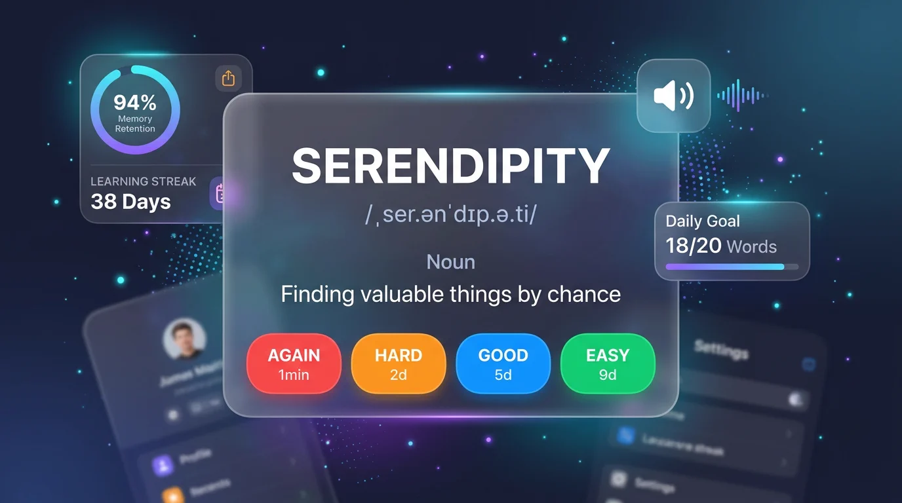
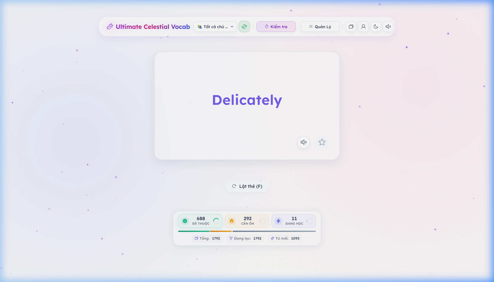
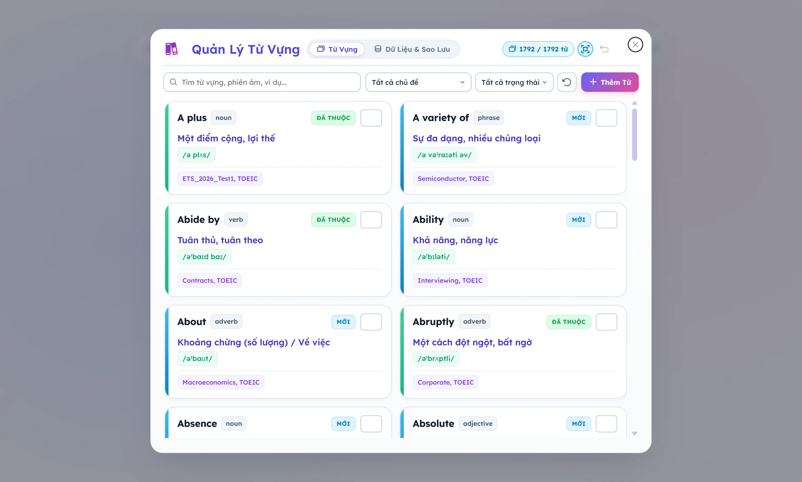
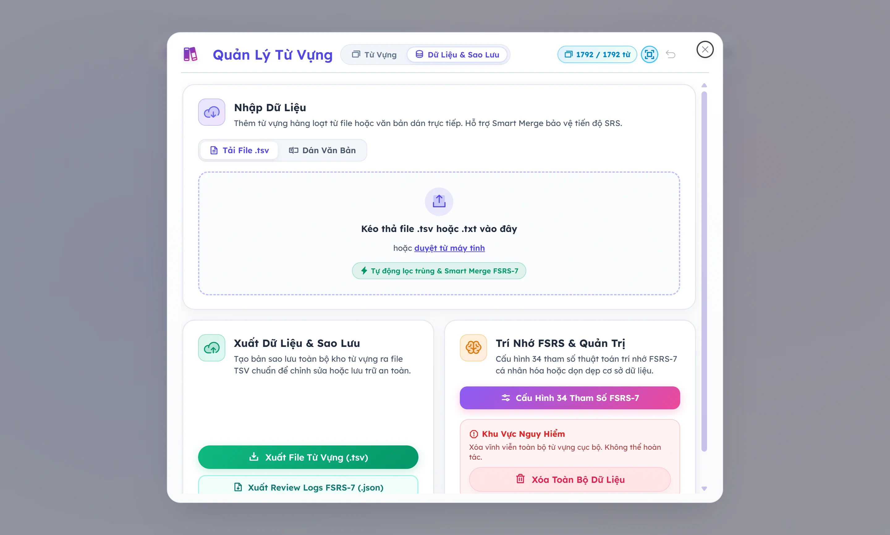
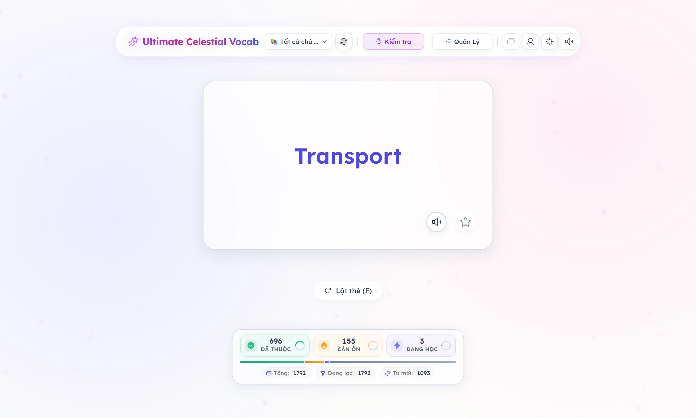
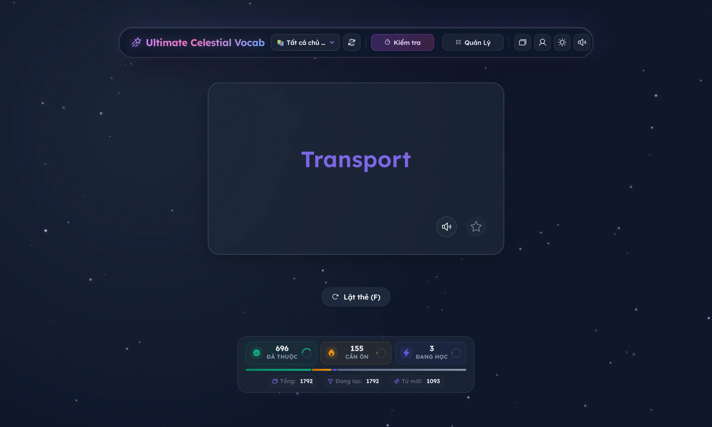
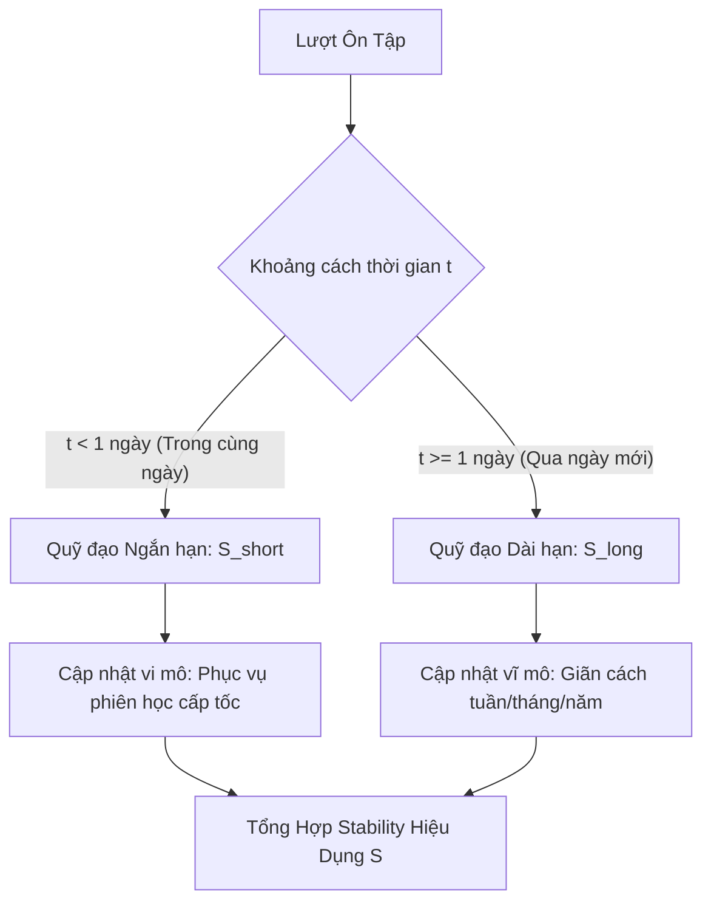
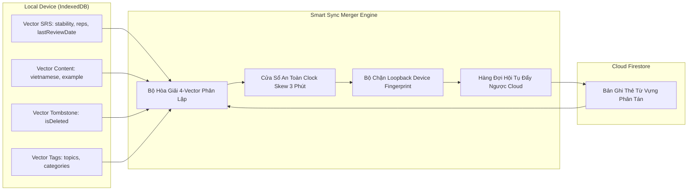
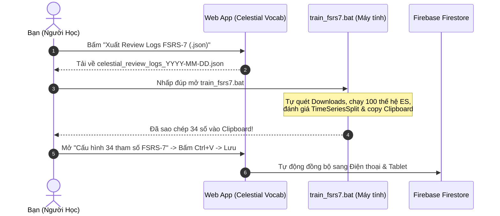
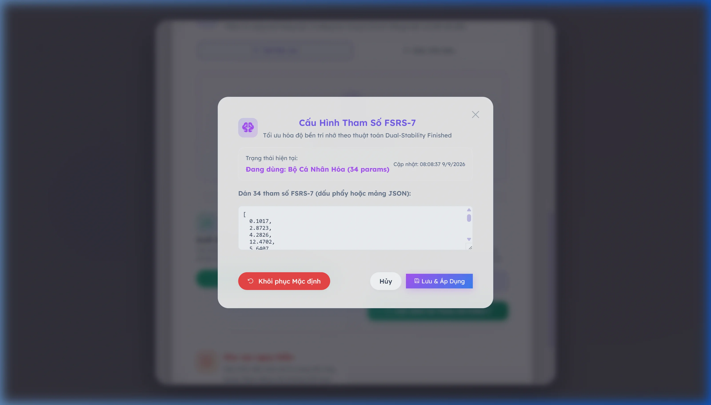

# Ultimate Celestial Vocab ✨

<div align="center">


-blueviolet.svg?style=for-the-badge)


-success.svg?style=for-the-badge)


<br/>

**Nền tảng học từ vựng tiếng Anh cá nhân hóa thế hệ mới kết hợp thuật toán lặp lại ngắt quãng FSRS-7 (34 tham số), Heuristics ngôn ngữ học, Bộ đồng bộ đa thiết bị 4-Vector và Hệ sinh thái Offline-First PWA.**

[🌐 Trải Nghiệm Ứng Dụng Thực Tế](https://chat-wywy.web.app) • [📖 Xem Tài Liệu Thiết Kế Kỹ Thuật](DESIGN_DOC.md) • [📊 Xem Dữ Liệu Benchmark](#benchmark)

<br/>



<br/>


</div>

---

## 📑 Mục Lục
- [1. Giới Thiệu & Tầm Nhìn Sản Phẩm](#1-gioi-thieu--tam-nhin-san-pham)
- [2. Trải Nghiệm Người Dùng & Các Tính Năng Đỉnh Cao](#2-trai-nghiem-nguoi-dung--cac-tinh-nang-dinh-cao)
  - [2.1. Không Gian Học Tập Trực Quan & Sóng Âm Thanh Động](#21-khong-gian-hoc-tap-truc-quan--song-am-thanh-dong)
  - [2.2. Trung Tâm Quản Lý Từ Vựng & Quét Trùng Lặp Thông Minh](#22-trung-tam-quan-ly-tu-vung--quet-trung-lap-thong-minh)
  - [2.3. Bảng Điều Khiển Hồ Sơ & Thống Kê Vi Mô FusionSRS](#23-bang-dieu-khien-ho-so--thong-ke-vi-mo-fusionsrs)
  - [2.4. Chế Độ Dark Mode Đẳng Cấp Phi Thuyền Thiên Hà](#24-che-do-dark-mode-dang-cap-phi-thuyen-thien-ha)
- [3. Cơ Sở Khoa Học & Thuật Toán Trí Nhớ FSRS-7](#3-co-so-khoa-hoc--thuat-toan-tri-nho-fsrs-7)
  - [3.1. Mô hình DSR (Difficulty - Stability - Retrievability)](#31-mo-hinh-dsr-difficulty---stability---retrievability)
  - [3.2. Kiến Trúc Trí Nhớ Kép (Dual-Track Stability)](#32-kien-truc-tri-nho-kep-dual-track-stability)
  - [3.3. Động Học Độ Khó & Hội Tụ Trung Bình (Mean Reversion)](#33-dong-hoc-do-kho--hoi-tu-trung-binh-mean-reversion)
  - [3.4. Ba Đột Phá Độc Quyền Của Celestial Vocab](#34-ba-dot-pha-doc-quyen-cua-celestial-vocab)
- [4. Động Cơ Đồng Bộ Đa Thiết Bị Hai Chiều (4-Vector Sync Engine)](#4-dong-co-dong-bo-da-thiet-bi-hai-chieu-4-vector-sync-engine)
- [5. Bộ Tối Ưu Hóa Tham Số Ngoại Tuyến (Offline Optimizer)](#5-bo-toi-uu-hoa-tham-so-ngoai-tuyen-offline-optimizer)
  - [5.1. Chiến Lược Tiến Hóa (1+λ)-ES](#51-chien-luoc-tien-hoa-1λ-es)
  - [5.2. Kiểm Định Ngoại Suất Tương Lai (TimeSeriesSplit)](#52-kiem-dinh-ngoai-suat-tuong-lai-timeseriessplit)
- [6. Bằng Chứng & Dữ Liệu Thực Nghiệm (Benchmark)](#6-bang-chung--du-lieu-thuc-nghiem-benchmark)
- [7. Hướng Dẫn Sử Dụng & Huấn Luyện 1-Click](#7-huong-dan-su-dung--huan-luyen-1-click)
- [8. Kiến Trúc Hệ Thống & Cấu Trúc Mã Nguồn](#8-kien-truc-he-thong--cau-truc-ma-nguon)
- [9. Hướng Dẫn Cài Đặt & Phát Triển Cục Bộ](#9-huong-dan-cai-dat--phat-trien-cuc-bo)
- [10. Giấy Phép & Tác Giả](#10-giay-phep--tac-gia)

---

## 1. Giới Thiệu & Tầm Nhìn Sản Phẩm

Hầu hết các phần mềm học từ vựng truyền thống hiện nay (Anki cổ điển, Quizlet, SuperMemo SM-2) đều gặp phải các giới hạn sinh học và kỹ thuật cố hữu:
1. **"Ease Hell" (Địa ngục độ dễ):** Khi người học lỡ bấm nút *Hard* hoặc *Again*, hệ số Ease Factor bị trừ vĩnh viễn, khiến thẻ bài bị lặp lại dày đặc quá mức gây chán nản.
2. **Đồng nhất hóa não bộ:** Giả định rằng mọi bộ não đều quên theo cùng một tốc độ và mọi từ vựng đều có độ khó khởi điểm như nhau.
3. **Thiếu sự phân hóa phản xạ:** Không phân biệt được giữa việc nhìn nhận mặt chữ thụ động (Flashcard flip) với việc kích hoạt hồi tưởng chủ động bằng cách gõ phím chính xác (Active Typing Recall).
4. **Xung đột đồng bộ đa thiết bị:** Đè bẹp dữ liệu khi học trên cả máy tính lẫn điện thoại, làm mất tiến độ ghi nhớ SRS.

**Ultimate Celestial Vocab** được kiến tạo như một ứng dụng web lũy tiến (PWA) cao cấp giải quyết triệt để các rào cản trên:
- **Lõi FSRS-7 (Free Spaced Repetition Scheduler - Thế hệ 7):** Mô hình toán học chính xác nhất hiện nay với 34 tham số sinh học độc bản.
- **Linguistic Heuristics v2:** Bộ máy phân tích âm tiết, cấu trúc cụm từ và hình thái ngôn ngữ để tính toán độ khó xuất phát điểm $D_0$ khách quan ngay từ khi người học chưa chạm vào thẻ.
- **Động cơ đồng bộ 4 Vector độc lập:** Triệt tiêu hoàn toàn xung đột dữ liệu giữa PC, Laptop và Smartphone.
- **Trải nghiệm thẩm mỹ vũ trụ (Celestial Aesthetics):** Giao diện kính mờ Glassmorphism, hệ thống bảng đo vi mô HUD, hoạt ảnh hạt canvas không gian và bảng màu Light Mode chuẩn WCAG 2.1 AA.

---

## 2. Trải Nghiệm Người Dùng & Các Tính Năng Đỉnh Cao

### 2.1. Không Gian Học Tập Trực Quan & Sóng Âm Thanh Động

Ứng dụng kết hợp giữa hồi tưởng thị giác, thính giác (Web Audio API TTS) và vận động cơ tay (Active Typing):

<div align="center">

| Mặt Trước (Từ Vựng, Phiên Âm IPA & Sóng Âm) | Mặt Sau (Định Nghĩa, Ngữ Cảnh & 4 Mức Đánh Giá SRS) |
| :---: | :---: |
|  |  |

*Giao diện học từ vựng trực quan với hoạt ảnh sóng âm thanh khi phát âm, hỗ trợ phím tắt bàn phím (`Space` lật thẻ, `1, 2, 3, 4` đánh giá SRS).*

</div>

---

### 2.2. Trung Tâm Quản Lý Từ Vựng & Quét Trùng Lặp Thông Minh

Trung tâm Quản lý Từ vựng v4.3 được thiết kế theo triết lý tối giản đa tầng:

<div align="center">

| Tab Danh Sách Từ Vựng (Bảng Màu Pastel Tươi Sáng) | Tab Dữ Liệu & Sao Lưu (Single-Layer Bento Grid) |
| :---: | :---: |
|  |  |

</div>

- **Thẻ từ vựng Pastel tràn đầy sức sống:** Huy hiệu trạng thái SRS màu tươi tắn (Mới `#0284c7`, Đang học `#d97706`, Đã thuộc `#16a34a`), dải gradient phát sáng 6px, chip phiên âm bạc hà và chip từ loại định danh gọn gàng.
- **Bộ Quét Trùng Lặp Radar (`ph-scan`):** Công cụ dò tìm và hợp nhất thông minh từ vựng trùng lặp theo cơ chế **bảo toàn tiến độ FSRS-7 cao nhất**, triệt tiêu rủi ro mất công sức học tập.
- **Bố cục siêu tinh gọn (Ultra-Compact Header):** Gom toàn bộ thanh điều khiển và điều hướng chỉ trong 2 hàng thanh thoát, cuộn vô tận mượt mà qua `IntersectionObserver`.
- **Nhập/Xuất chuẩn hóa TSV & JSON:** Kéo thả tệp dữ liệu, sao lưu an toàn kho từ vựng và trích xuất Review Logs phục vụ tái huấn luyện mô hình.

---

### 2.3. Bảng Điều Khiển Hồ Sơ & Thống Kê Vi Mô FusionSRS

Bảng điều khiển học tập v4.2 phân tách các tầng thông tin với độ tương phản sắc sảo:

<div align="center">



*Bảng điều khiển Hồ Sơ & Thống Kê: Cấp độ học giả mạ bạc kim loại, chuỗi ngày học rực lửa, biểu đồ dự báo ôn tập 7 ngày, ma trận nhiệt thiên hà và cụm vi đo HUD FusionSRS.*

</div>

- **Hệ Vi Đo Trí Nhớ Chuẩn HUD (Telemetry Micro-Meters):** Theo dõi thời gian thực 3 chỉ số vàng:
  - **Mức Độ Thuộc Bài (% Retention):** Đo lường xác suất nhớ lại trung bình toàn bộ kho từ vựng.
  - **Thời Gian Nhớ Tự Nhiên (Stability S):** Chu kỳ ổn định của trí nhớ dài hạn (tính bằng ngày).
  - **Tổng Số Lần Đã Ôn Tập (Total Reviews):** Đo lường khối lượng kiến thức đã tích lũy.
- **Cấp Bậc Học Giả & Hệ Thống Huy Hiệu:** 5 cấp bậc danh hiệu (Đồng, Bạc, Vàng, Bạch Kim, Kim Cương) cùng bộ sưu tập huy hiệu thành tựu mở khóa theo chuỗi ngày học và độ khó từ vựng.
- **Biểu Đồ Nhiệt Thiên Hà (Activity Heatmap):** Bảng màu ngọc bích đa sắc thể hiện mật độ ôn tập liên tục 60 ngày.

---

### 2.4. Chế Độ Dark Mode Đẳng Cấp Phi Thuyền Thiên Hà

<div align="center">



*Giao diện nền sao Obsidian với ánh sáng huỳnh quang neon tím dịu mắt, tối ưu hoàn hảo cho các phiên học đêm dài.*

</div>

---

## 3. Cơ Sở Khoa Học & Thuật Toán Trí Nhớ FSRS-7

<a id="dsr-model"></a>
### 3.1. Mô hình DSR (Difficulty - Stability - Retrievability)
Trí nhớ con người đối với một thông tin được mô hình hóa bởi 3 biến trạng thái cốt lõi:
- **Độ khó ($D \in [1, 10]$):** Thước đo độ phức tạp vốn có của từ vựng đối với não bộ người học.
- **Độ bền ($S > 0$ tính bằng ngày):** Thời gian cần thiết để xác suất nhớ của từ vựng giảm từ $100\%$ xuống còn $90\%$.
- **Khả năng gợi nhớ ($R \in [0, 1]$):** Xác suất người học có thể nhớ lại thành công từ vựng đó tại thời điểm $t$ ngày sau lần ôn gần nhất.

Đường cong lãng quên tuân theo hàm lũy thừa tổng quát (Power-Law Forgetting Curve):

$$R(t, S) = \left(1 + F \cdot \frac{t}{S}\right)^{-w_0}$$

Trong đó:
- Hệ số phân rã $F = \frac{19}{81} \approx 0.2345679$.
- $w_0$ là tham số mũ suy giảm trí nhớ (mặc định $\approx 0.1443$).
- Khi thời gian trôi qua đúng bằng độ bền ($t = S$), ta luôn có:

$$R(S, S) = \left(1 + \frac{19}{81}\right)^{-0.1443} = 0.90 \quad (90\%)$$

---

<a id="dual-track"></a>
### 3.2. Kiến Trúc Trí Nhớ Kép (Dual-Track Stability)
Không giống như các thuật toán đời cũ chỉ theo dõi một con số Interval duy nhất, FSRS-7 chia tách độ bền trí nhớ thành hai quỹ đạo song song:



1. **$S_{\text{short}}$ (Short-term Stability):**
   * Theo dõi trí nhớ làm việc (Working Memory) trong các khoảng cách ngắn (vài phút đến dưới 1 ngày).
   * Đảm bảo các từ vựng mới học không bị giãn cách quá xa ngay trong phiên học đầu tiên.
2. **$S_{\text{long}}$ (Long-term Stability):**
   * Đo lường vết nhớ dài hạn (Long-term Potentiation) qua các ngày, tuần, tháng.
   * Được tính toán dựa trên độ khó $D$, độ bền hiện tại $S$, khả năng hồi tưởng $R$ và đánh giá của người học qua công thức tăng trưởng phi tuyến:

$$S_{\text{new}} = S \cdot \left(e^{w_8} \cdot (11 - D) \cdot S^{-w_9} \cdot \left(e^{w_{10} \cdot (1 - R)} - 1\right) \cdot \text{Multiplier}(\text{Grade}) + 1\right)$$

---

<a id="mean-reversion"></a>
### 3.3. Động Học Độ Khó & Hội Tụ Trung Bình (Mean Reversion)
Độ khó $D$ không cố định mà biến thiên linh hoạt theo từng phản hồi của người học (Again = 1, Hard = 2, Good = 3, Easy = 4):

$$\Delta D = -w_6 \cdot (\text{Grade} - 3)$$

Sau đó, độ khó được kéo về giá trị cân bằng sinh học $D_0$ (Mean Reversion) để chống hiện tượng thẻ bài bị kẹt vĩnh viễn ở trạng thái siêu khó:

$$D_{\text{next}} = w_5 \cdot D_0 + (1 - w_5) \cdot \text{clamp}(D + \Delta D, 1, 10)$$

---

<a id="dot-pha"></a>
### 3.4. Ba Đột Phá Độc Quyền Của Celestial Vocab

| Tính Năng | Cơ Chế Toán Học | Lợi Ích Thực Tiễn |
| :--- | :--- | :--- |
| **1. Linguistic Bias Parity** | $D_{\text{start}} = w_4 + \text{getDifficultyBias}(\text{word})$ | Khắc phục hoàn toàn hiện tượng Cold-Start. Các từ đa âm tiết, dài hoặc mang cấu trúc phức tạp tự động nhận độ khó xuất phát $D_0$ cao hơn, ngăn ngừa tình trạng quá tải. |
| **2. Typing Modality Bonus** | $S_{\text{long}} \leftarrow S_{\text{long}} \times 1.25$ khi gõ đúng | Phản ánh chính xác tâm lý học nhận thức: Gõ đúng chính tả (Active Motor Recall) kích hoạt liên kết nơ-ron sâu hơn $25\%$ so với chỉ lật xem flashcard thông thường. |
| **3. Chốt Chặn An Toàn Đầu Tiên** | $\text{Interval}_{\text{init}} \le 21\text{ ngày}$ | Triệt tiêu hoàn toàn rủi ro người học vô tình bấm nhầm nút **"Easy"** trên thẻ mới tinh làm từ vựng trôi mất 4 tháng mà không được củng cố. |

---

## 4. Động Cơ Đồng Bộ Đa Thiết Bị Hai Chiều (4-Vector Sync Engine)

Để phục vụ người học luân chuyển linh hoạt giữa máy tính bàn, laptop và điện thoại thông minh, ứng dụng triển khai kiến trúc đồng bộ dữ liệu phi đối xứng giải quyết triệt để xung đột:



### Các trụ cột kỹ thuật của Động cơ Sync:
1. **Phân lập 4 Vector độc lập (Disentangled Vector Merge):** Nếu người dùng sửa nghĩa từ vựng trên PC nhưng ôn tập thẻ trên Mobile, hệ thống bảo tồn nguyên vẹn cả nghĩa mới trên PC lẫn tiến độ FSRS-7 mới nhất từ Mobile thay vì ghi đè thô bạo kiểu Last-Write-Wins.
2. **Cửa sổ an toàn 3 phút chống lệch đồng hồ (Clock Skew Window):** Bù trừ chênh lệch múi giờ và độ trôi đồng hồ phần cứng giữa các thiết bị ngoại tuyến.
3. **Chặn phản xạ vòng lặp (Loopback Echo Suppression):** Mỗi thiết bị gắn một `deviceId` định danh; khi Cloud snapshot trả về sự kiện do chính thiết bị đó phát ra, luồng xử lý tự động bỏ qua để tiết kiệm băng thông và tài nguyên CPU.
4. **Hội tụ dữ liệu chủ động (Convergence Push Queue):** Bất kỳ thẻ nào sau khi merge tại máy trạm có dữ liệu phong phú hơn phiên bản Cloud sẽ được đẩy ngược lên Firestore để các thiết bị còn lại tự động đồng quy về trạng thái chuẩn nhất.

---

## 5. Bộ Tối Ưu Hóa Tham Số Ngoại Tuyến (Offline Optimizer)

Nằm trong thư mục [tools/train_fsrs7.js](file:///c:/Users/ASUS/Desktop/CODING/test%20v3/ultimate-celestial-vocab%20-%20vipper%201/tools/train_fsrs7.js), công cụ huấn luyện cá nhân hóa hoạt động hoàn toàn độc lập với các ưu điểm vượt trội:
- **Zero-Dependency:** Chỉ sử dụng module gốc của Node.js (`fs`, `path`, `os`, `child_process`).
- **Tương thích toàn diện:** Tích hợp sẵn `train_fsrs7.bat` hỗ trợ kéo-thả (Drag & Drop) và tự động nhận diện file log trong thư mục `Downloads`.
- **Tự động sao chép Clipboard:** Đưa ngay 34 tham số đã tối ưu vào bộ nhớ đệm máy tính để người dùng dán vào Web (`Ctrl + V`).

<a id="thuat-toan-es"></a>
### 5.1. Chiến Lược Tiến Hóa (1+λ)-ES
Để tối ưu hóa không gian 34 chiều phi lồi (non-convex), bộ optimizer áp dụng thuật toán **Evolutionary Strategy** kết hợp phân phối đột biến Cauchy:
- **Cá thể cha (Parent Vector):** Khởi tạo từ bộ tham số chuẩn mặc định $W_{\text{base}} \in \mathbb{R}^{34}$.
- **Quần thể con (Offspring $\lambda = 30$):** Mỗi thế hệ sinh ra 30 đột biến bằng phân phối đuôi dài Cauchy:

$$W_{\text{child}}^{(i)} = W_{\text{parent}} + \sigma \cdot \boldsymbol{\eta}_i, \quad \boldsymbol{\eta}_i \sim \text{Cauchy}(0, \mathbf{I})$$

- **Hàm mục tiêu (Loss Function):** Cực tiểu hóa sai số Binary Cross-Entropy (BCE) giữa xác suất dự đoán $P_i$ và kết quả nhớ thực tế $Y_i \in \{0, 1\}$, có kèm điều chuẩn $L_2$ để chống học vẹt:

$$\mathcal{L}(W) = -\frac{1}{N} \sum_{i=1}^N \left[ Y_i \ln(P_i) + (1 - Y_i) \ln(1 - P_i) \right] + \lambda_{\text{reg}} \sum_{j=1}^{34} (W_j - W_{\text{base}, j})^2$$

---

<a id="timeseriessplit"></a>
### 5.2. Kiểm Định Ngoại Suất Tương Lai (TimeSeriesSplit)
Để đảm bảo bộ tham số tìm được không bị Overfitting (học thuộc lòng dữ liệu quá khứ), bộ optimizer triển khai phương pháp phân tách chuỗi thời gian:
1. Sắp xếp toàn bộ dữ liệu lịch sử theo thứ tự thời gian tăng dần từ quá khứ đến hiện tại.
2. Dùng **$80\%$ dữ liệu đầu tiên** (quá khứ) làm tập huấn luyện.
3. Giữ lại **$20\%$ dữ liệu gần nhất** (tương lai) làm tập kiểm thử ngoại suất (Out-of-Sample Test).
4. Nếu sai số BCE trên tập tương lai giảm đi so với mô hình mặc định, mô hình đạt chứng chỉ tổng quát hóa an toàn.

---

<a id="benchmark"></a>
## 6. Bằng Chứng & Dữ Liệu Thực Nghiệm (Benchmark)

Dữ liệu được kiểm định trực tiếp trên tập log học tập thực tế của người dùng:
- **Tổng số lượt ôn tập:** $4.046$ lượt.
- **Số lượng thẻ ôn lặp lại $\ge 2$ lần:** $668$ thẻ.
- **Khoảng thời gian ghi nhận:** 73.5 ngày liên tục.

```
================================================================================
                           KẾT QUẢ TỐI ƯU HOÁ FSRS-7                            
================================================================================
📉 Sai số gốc (Baseline Loss):        0.30443
🏆 Sai số tối ưu (Optimized Loss):    0.29050
📈 Cải thiện tổng thể (In-Sample):    +4.58%

--- KIỂM ĐỊNH NGOẠI SUẤT TƯƠNG LAI (TimeSeriesSplit: 80% Train / 20% Test) ---
⏱️ Mốc thời gian chia tách:           701 lượt ôn tương lai
📊 Sai số kiểm thử gốc (Baseline):    0.34333
🎯 Sai số kiểm thử tối ưu (User):     0.33450
🚀 Cải thiện Out-of-Sample:           +2.57% (Mô hình tổng quát hóa tốt, không học vẹt)
```

### Bảng Hiệu Chuẩn Xác Suất Trí Nhớ (Calibration Table)
Bảng hiệu chuẩn đo đạc mức độ trùng khớp giữa xác suất mô hình dự đoán ($P$) và tỷ lệ thực tế người học bấm nhớ được ($Y=1$):

| Phân Nhóm Xác Suất | Số Lượt Ôn Tập | $P$ Dự Đoán | Thực Tế Nhớ | Độ Lệch ($\Delta$) | Đánh Giá |
| :--- | :---: | :---: | :---: | :---: | :--- |
| **Dưới 70%** | 76 | 58.4% | 59.3% | **-0.9%** | Tuyệt hảo |
| **70% - 80%** | 158 | 75.5% | 75.9% | **-0.4%** | Cực kỳ sát thực tế |
| **80% - 85%** | 237 | 82.4% | 87.3% | **-4.8%** | Tốt |
| **85% - 90%** | 610 | 87.7% | 87.2% | **+0.5%** | Khớp gần như tuyệt đối |
| **90% - 95%** | 1.157 | 92.9% | 93.2% | **-0.4%** | Khớp hoàn hảo |
| **95% - 100%** | 1.146 | 97.3% | 96.4% | **+0.9%** | Khớp hoàn hảo |

> **Chỉ số sai số toàn dải:** $\text{RMSE}_{\text{bins}} = \mathbf{2.07\%}$.  
> Con số này chứng minh thuật toán FSRS-7 đã mô phỏng chính xác đường cong lãng quên sinh học của người học với sai số trung bình chỉ khoảng $2\%$.

---

## 7. Hướng Dẫn Sử Dụng & Huấn Luyện 1-Click

Chỉ với 3 bước đơn giản, bạn có thể biến mô hình FSRS-7 thành trợ lý học tập độc bản cho riêng mình:



1. **Bước 1 — Xuất dữ liệu:** Vào mục **Quản lý từ vựng** $\to$ Tab **"Dữ Liệu & Sao Lưu"** $\to$ Bấm **"Xuất Review Logs FSRS-7 (.json)"**.
2. **Bước 2 — Chạy tối ưu hóa:** Nhấp đúp vào file `train_fsrs7.bat` trên máy tính. Script sẽ tự động quét tệp log mới nhất, chạy 100 thế hệ tối ưu và tự động sao chép 34 số vào bộ nhớ đệm Clipboard.
3. **Bước 3 — Nạp vào ứng dụng:** Bấm nút **"Cấu Hình 34 Tham Số FSRS-7"** $\to$ Nhấn `Ctrl + V` $\to$ Bấm **"Lưu & Áp Dụng"**.

<div align="center">



*Hộp thoại cấu hình 34 tham số FSRS-7 tích hợp bộ xác thực thời gian thực và nút khôi phục về cấu hình chuẩn.*

</div>

---

## 8. Kiến Trúc Hệ Thống & Cấu Trúc Mã Nguồn

```
ultimate-celestial-vocab/
├── .env.example                # Khung mẫu cấu hình biến môi trường Firebase
├── index.html                  # Giao diện chính SPA & Các Modal Điều Khiển
├── package.json                # Cấu hình dự án Vite + PWA Plugin
├── run_trainer.bat             # Shortcut khởi chạy bộ huấn luyện FSRS-7
├── train_fsrs7.bat             # Trình chạy tối ưu hóa tự động trên Windows
├── docs/
│   └── screenshots/            # Kho lưu trữ ảnh chụp màn hình nén WebP siêu nhẹ
├── tools/
│   └── train_fsrs7.js          # Lõi tối ưu hóa (1+λ)-ES, TimeSeriesSplit, Calibration
├── scratch/                    # Bộ kịch bản kiểm thử thuật toán & hòa giải Sync
│   ├── test_fsrs7_scenarios.js # 179 kịch bản ma trận kiểm thử FSRS-7
│   ├── test_fsrs7_validation.js# Bộ kiểm thử xác thực cấu hình 34 số
│   └── test_sync_merger.mjs    # Bộ kiểm thử đối kháng hòa giải đồng bộ đa thiết bị
└── src/
    ├── core/                   # Tầng nghiệp vụ lõi & thuật toán
    │   ├── animations.js       # Quản lý hoạt ảnh giao diện & modal
    │   ├── firebase.js         # Kết nối Firestore, Storage & Smart Sync
    │   ├── idb.js              # Tầng lưu trữ IndexedDB cục bộ (Offline-First)
    │   ├── queue.js            # Quản lý hàng đợi ôn tập thông minh
    │   ├── sound.js            # Engine phát âm thanh Web Audio API & TTS
    │   ├── state.js            # Quản lý trạng thái ứng dụng tập trung
    │   ├── sync.js             # Thuật toán hòa giải 4-Vector đồng bộ phân tán
    │   └── srs/                # Hệ sinh thái thuật toán FSRS-7
    │       ├── constants.js    # 34 tham số chuẩn, giới hạn biên & validator
    │       ├── difficulty.js   # Động học biến thiên độ khó D
    │       ├── forgetting.js   # Mô hình đường cong lãng quên R(t, S)
    │       ├── heuristics.js   # Bộ phân tích độ khó ngôn ngữ học v2
    │       ├── index.js        # Điều phối chính & chốt chặn 21 ngày
    │       └── stability.js    # Động học độ bền trí nhớ S (ngắn hạn & dài hạn)
    ├── features/               # Các module tính năng mở rộng
    │   ├── badges.js           # Hệ thống huy hiệu & danh hiệu học giả
    │   ├── gamification.js     # Điểm kinh nghiệm XP, cấp độ, chuỗi ngày streak
    │   ├── io.js               # Nhập/xuất dữ liệu JSON/TSV, cấu hình tham số
    │   ├── quiz.js             # Chế độ kiểm tra trắc nghiệm & tự luận
    │   └── typing.js           # Trình bắt phím gõ chính tả (Active Typing Modality)
    └── ui/                     # Giao diện người dùng
        ├── celestial-canvas.js # Hiệu ứng hạt nền không gian vũ trụ
        ├── elements.js         # Bộ đệm tham chiếu DOM elements
        ├── modal.js            # Điều khiển đóng/mở popup, hộp thoại cài đặt
        ├── render.js           # Render thẻ từ, danh sách từ vựng, biểu đồ & HUD
        └── waveform.js         # Hoạt ảnh sóng âm thanh khi phát âm
```

---

## 9. Hướng Dẫn Cài Đặt & Phát Triển Cục Bộ

### Yêu cầu hệ thống
- **Node.js:** Phiên bản `18.0.0` trở lên (Đã kiểm thử trên Node.js `v26.1.0`).
- **Trình duyệt:** Google Chrome, Edge, Firefox hoặc Safari phiên bản mới nhất hỗ trợ Web Audio API và IndexedDB.

### Các bước cài đặt

1. **Clone repository:**
   ```bash
   git clone https://github.com/DATWY/ultimate-celestial-vocab.git
   cd ultimate-celestial-vocab
   ```

2. **Cài đặt dependencies:**
   ```bash
   npm install
   ```

3. **Cấu hình môi trường:**
   ```bash
   cp .env.example .env
   ```
   Điền thông số Firebase project của bạn vào file `.env`.

4. **Khởi chạy Development Server:**
   ```bash
   npm run dev
   ```
   Truy cập vào địa chỉ `http://localhost:5173`.

5. **Chạy kiểm thử thuật toán FSRS-7 & Bộ Đồng Bộ:**
   ```bash
   # Chạy 179 kịch bản ma trận kiểm thử FSRS-7
   node scratch/test_fsrs7_scenarios.js

   # Chạy kiểm thử đối kháng bộ hòa giải đồng bộ đa thiết bị
   node scratch/test_sync_merger.mjs
   ```

6. **Đóng gói & Xuất bản Production:**
   ```bash
   npm run build
   firebase deploy --only hosting -m "Production release"
   ```

---

## 10. Giấy Phép & Tác Giả

Dự án được nghiên cứu, phát triển và duy trì bởi **[DATWY](https://github.com/DATWY)**.  
Phát hành theo giấy phép **MIT License**. Bạn hoàn toàn có quyền sử dụng, sửa đổi và phân phối lại cho mục đích nghiên cứu hoặc thương mại.

<div align="center">

⭐ **Nếu bạn thấy dự án hữu ích cho hành trình học ngoại ngữ của mình, hãy tặng một ngôi sao (Star) trên GitHub nhé!** ⭐

</div>
